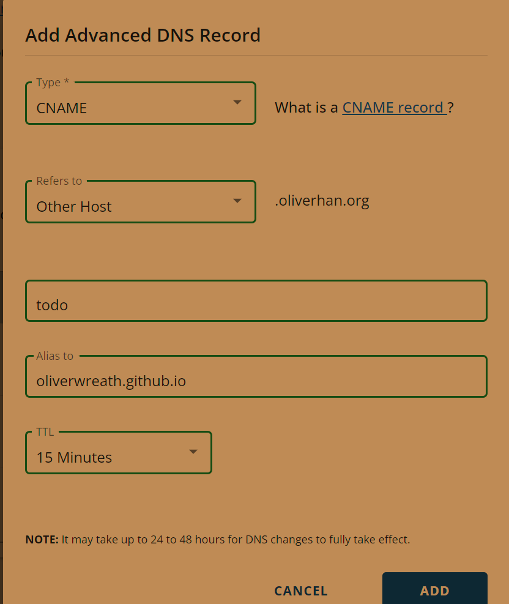

# If the domain is unreachable
Subdomains are configured with a CNAME record through your DNS provider. For more information, see "Managing a custom domain for your GitHub Pages site."
https://docs.github.com/en/pages/configuring-a-custom-domain-for-your-github-pages-site/managing-a-custom-domain-for-your-github-pages-site#configuring-a-subdomain
Subdomain
(www.example.com,
blog.example.com)	CNAME	SUBDOMAIN	USERNAME.github.io or
ORGANIZATION.github.io

So, in host > add CNAME > oliverwreath.github.io/Angular-RESTful/ > 


Then test reachable:
https://oliverwreath.github.io/Angular-RESTful/
https://todo.oliverhan.org/

# Initial Setup (start afresh cheatsheet)
```bash
# angular-cli
#ng new [PROJECT NAME]
#cd [PROJECT NAME]
#ng serve -o
# bootstrap Sticky footer with fixed navbar 
# https://getbootstrap.com/docs/5.1/examples/sticky-footer-navbar/
npm i bootstrap@5.2.1 #https://getbootstrap.com/docs/versions/
# https://www.npmjs.com/package/@ng-bootstrap/ng-bootstrap
#npm i @ng-bootstrap/ng-bootstrap
```

# Build Instructions 🌹
```bash
git checkout -b master
git push --delete origin gh-pages
git branch -d gh-pages
git checkout -b gh-pages
git push origin gh-pages
npm audit fix
npm prune 
#ng add angular-cli-ghpages --project Angular-RESTful
npm install
#ng deploy --base-href=/Angular-RESTful/
ng deploy --branch=gh-pages --cname=todo.oliverhan.org
```


# Example Json data from provided api 
```bash
# https://reqres.in/api/users
```

# TODO 
- Free Online TODO list
